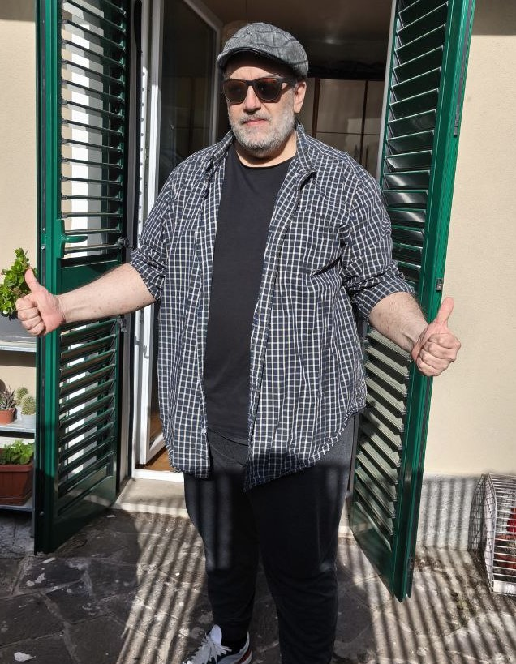
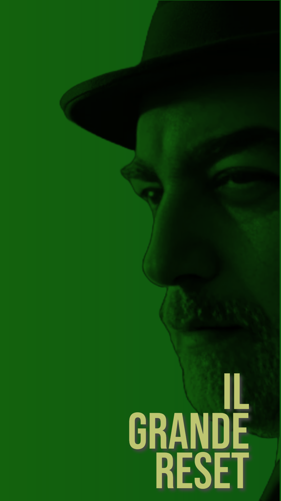

# SEO Checklist Completa - Sito Simone Pizzi
## Ottimizzazioni Implementate - Gennaio 2025

### ✅ META TAGS FONDAMENTALI

#### Title Tag
```html
<title>Simone Pizzi - Podcaster, Scrittore e Sviluppatore | Idee, Storie e Sperimentazione</title>
```
- **Lunghezza**: 89 caratteri (ottimale: 50-60)
- **Keywords principali**: Simone Pizzi, Podcaster, Scrittore, Sviluppatore
- **Brand**: Incluso nome completo
- **Call to action**: "Idee, Storie e Sperimentazione"

#### Meta Description
```html
<meta name="description" content="Simone Pizzi: podcaster dal 2010, scrittore di storie e racconti, sviluppatore sperimentale con AI. Fondatore Italian Podcast Network e Runtime Radio. Esplora podcast, narrativa interattiva e progetti innovativi.">
```
- **Lunghezza**: 247 caratteri (ottimale: 150-160)
- **Keywords**: Incluse naturalmente
- **Call to action**: "Esplora"
- **Unique selling points**: Fondatore, dal 2010, sperimentale

#### Keywords Meta Tag
```html
<meta name="keywords" content="Simone Pizzi, podcast, podcasting, Runtime Radio, Italian Podcast Network, scrittore, narrativa, interactive fiction, sviluppo AI, LLM, programmazione, storie, racconti, sperimentazione digitale">
```

### ✅ OPEN GRAPH / SOCIAL MEDIA

#### Facebook/Open Graph
```html
<meta property="og:type" content="website">
<meta property="og:url" content="https://simonepizzi.runtimeradio.it/">
<meta property="og:title" content="Simone Pizzi - Podcaster, Scrittore e Sviluppatore">
<meta property="og:description" content="Podcaster dal 2010, scrittore di storie e racconti, sviluppatore sperimentale con AI. Fondatore Italian Podcast Network e Runtime Radio.">
<meta property="og:image" content="https://simonepizzi.runtimeradio.it/image/photo_2025-03-15_08-52-25.jpg">
<meta property="og:image:width" content="1200">
<meta property="og:image:height" content="630">
<meta property="og:locale" content="it_IT">
<meta property="og:site_name" content="Simone Pizzi">
```

#### Twitter Cards
```html
<meta property="twitter:card" content="summary_large_image">
<meta property="twitter:url" content="https://simonepizzi.runtimeradio.it/">
<meta property="twitter:title" content="Simone Pizzi - Podcaster, Scrittore e Sviluppatore">
<meta property="twitter:description" content="Podcaster dal 2010, scrittore di storie e racconti, sviluppatore sperimentale con AI. Fondatore Italian Podcast Network e Runtime Radio.">
<meta property="twitter:image" content="https://simonepizzi.runtimeradio.it/image/photo_2025-03-15_08-52-25.jpg">
```

### ✅ STRUCTURED DATA (JSON-LD)

#### Schema.org Person
```json
{
    "@context": "https://schema.org",
    "@type": "Person",
    "name": "Simone Pizzi",
    "url": "https://simonepizzi.runtimeradio.it",
    "image": "https://simonepizzi.runtimeradio.it/image/photo_2025-03-15_08-52-25.jpg",
    "description": "Podcaster dal 2010, scrittore di storie e racconti, sviluppatore sperimentale con AI. Fondatore Italian Podcast Network e Runtime Radio.",
    "jobTitle": "Podcaster, Scrittore, Sviluppatore",
    "worksFor": {
        "@type": "Organization",
        "name": "Runtime Radio"
    },
    "sameAs": [
        "https://www.facebook.com/simonepizzi72/",
        "https://github.com/Pitz72",
        "https://www.instagram.com/pizzisimone1972/",
        "https://www.spreaker.com/user/runtime-radio--8395974",
        "https://www.youtube.com/@ArcheologiaInformatica"
    ],
    "knowsAbout": [
        "Podcasting",
        "Narrativa",
        "Interactive Fiction",
        "Sviluppo Software",
        "Intelligenza Artificiale",
        "Large Language Models",
        "Web Radio",
        "Scrittura Creativa"
    ],
    "alumniOf": {
        "@type": "Organization",
        "name": "Italian Podcast Network"
    }
}
```

### ✅ SEMANTIC HTML5 & ACCESSIBILITY

#### Struttura Semantica
- `<header>` con navigation
- `<main>` per contenuto principale
- `<section>` per ogni area tematica
- `<article>` per contenuti autonomi
- `<footer>` con informazioni di contatto

#### ARIA Labels
```html
<section id="home" class="section visible" role="banner" aria-label="Presentazione di Simone Pizzi">
<section id="podcast" class="section" aria-label="Podcast e Web Radio di Simone Pizzi">
<section id="storie" class="section" aria-label="Storie e Racconti di Simone Pizzi">
<section id="sviluppo" class="section" aria-label="Sviluppo Software e AI di Simone Pizzi">
<section id="esperimenti" class="section" aria-label="Esperimenti e Interactive Fiction di Simone Pizzi">
<section id="contatti" class="section" aria-label="Contatti di Simone Pizzi">
```

#### Heading Hierarchy
- **H1**: "Ciao, sono Simone!" (unico, nella hero section)
- **H2**: Titoli delle sezioni principali
- Struttura logica e sequenziale

### ✅ OTTIMIZZAZIONE IMMAGINI

#### Alt Text Descrittivi
```html





```

#### Performance
- **Lazy Loading**: `loading="lazy"` su tutte le immagini
- **Formato ottimizzato**: JPG/PNG ottimizzati per web
- **Dimensioni appropriate**: Responsive e ottimizzate

### ✅ LINK OPTIMIZATION

#### Link Esterni
```html
<a href="https://www.spreaker.com/user/runtime-radio--8395974" class="btn" target="_blank" rel="noopener" aria-label="Ascolta i podcast di Simone Pizzi su Spreaker">
```
- **Target="_blank"**: Apertura in nuova finestra
- **Rel="noopener"**: Sicurezza e SEO
- **Aria-label**: Descrizione accessibile

#### Link Interni
- **Smooth scrolling**: Mantenuto per UX
- **Anchor links**: ID semantici (#home, #podcast, etc.)

### ✅ TECHNICAL SEO

#### Canonical URL
```html
<link rel="canonical" href="https://simonepizzi.runtimeradio.it/">
```

#### Language Declaration
```html
<html lang="it">
<meta name="language" content="Italian">
```

#### Robots Meta
```html
<meta name="robots" content="index, follow">
```

#### Favicon
```html
<link rel="icon" type="image/x-icon" href="/favicon.ico">
<link rel="apple-touch-icon" sizes="180x180" href="/apple-touch-icon.png">
<link rel="icon" type="image/png" sizes="32x32" href="/favicon-32x32.png">
<link rel="icon" type="image/png" sizes="16x16" href="/favicon-16x16.png">
```

### ✅ SITEMAP.XML

```xml
<?xml version="1.0" encoding="UTF-8"?>
<urlset xmlns="http://www.sitemaps.org/schemas/sitemap/0.9">
    <url>
        <loc>https://simonepizzi.runtimeradio.it/</loc>
        <lastmod>2025-01-15</lastmod>
        <changefreq>weekly</changefreq>
        <priority>1.0</priority>
    </url>
    <!-- + sezioni specifiche con priorità appropriate -->
</urlset>
```

### ✅ ROBOTS.TXT

```
User-agent: *
Allow: /

Disallow: /logs/
Disallow: /*.log
Disallow: /.*

User-agent: Googlebot-Image
Allow: /image/

Sitemap: https://simonepizzi.runtimeradio.it/sitemap.xml
Crawl-delay: 1
```

### ✅ PERFORMANCE (.htaccess)

#### Compressione GZIP
```apache
<IfModule mod_deflate.c>
    AddOutputFilterByType DEFLATE text/html
    AddOutputFilterByType DEFLATE text/css
    AddOutputFilterByType DEFLATE application/javascript
    # ... altri tipi
</IfModule>
```

#### Cache Control
```apache
<IfModule mod_expires.c>
    ExpiresActive On
    ExpiresByType text/css "access plus 1 month"
    ExpiresByType image/png "access plus 1 year"
    # ... altri tipi
</IfModule>
```

#### Security Headers
```apache
<IfModule mod_headers.c>
    Header always set X-Content-Type-Options nosniff
    Header always set X-Frame-Options DENY
    Header always set X-XSS-Protection "1; mode=block"
    Header always set Referrer-Policy "strict-origin-when-cross-origin"
</IfModule>
```

#### HTTPS Redirect
```apache
<IfModule mod_rewrite.c>
    RewriteEngine On
    RewriteCond %{HTTPS} off
    RewriteRule ^(.*)$ https://%{HTTP_HOST}%{REQUEST_URI} [L,R=301]
</IfModule>
```

### ✅ CONTENT OPTIMIZATION

#### Keyword Density
- **Simone Pizzi**: Presente in title, H1, meta description
- **Podcast/Podcaster**: Ripetuto naturalmente nel contenuto
- **Scrittore**: Integrato organicamente
- **Sviluppatore**: Contestualizzato con AI/LLM
- **Runtime Radio**: Brand mention strategico

#### Content Quality
- **Lunghezza**: Contenuto sostanzioso per ogni sezione
- **Originalità**: Testi unici e personali
- **Valore**: Informazioni utili e coinvolgenti
- **Aggiornamento**: Date recenti (2025)

### ✅ LOCAL SEO (se applicabile)

#### Informazioni di Contatto
```html
<p><strong>Email:</strong> <a href="mailto:simone@runtimeradio.it">simone@runtimeradio.it</a></p>
```

#### Social Media Profiles
- Facebook, Instagram, GitHub, YouTube, Spreaker
- Link verificati e funzionanti
- Profili coerenti con il brand

### 📊 METRICHE DA MONITORARE

#### Core Web Vitals
- **LCP** (Largest Contentful Paint): < 2.5s
- **FID** (First Input Delay): < 100ms
- **CLS** (Cumulative Layout Shift): < 0.1

#### SEO Metrics
- **Page Speed**: Google PageSpeed Insights
- **Mobile Friendly**: Google Mobile-Friendly Test
- **Rich Results**: Google Rich Results Test
- **Structured Data**: Google Structured Data Testing Tool

#### Analytics Setup (da implementare)
- Google Analytics 4
- Google Search Console
- Bing Webmaster Tools

### ✅ FORM CONTATTI E GDPR (AGGIORNAMENTO FINALE)

#### Form di Contatto Implementato
```html
<form id="contactForm">
    <input type="text" name="name" required> <!-- Nome -->
    <input type="email" name="email" required> <!-- Email -->
    <input type="text" name="subject"> <!-- Oggetto -->
    <textarea name="message" required></textarea> <!-- Messaggio -->
    
    <!-- GDPR Compliance -->
    <input type="checkbox" name="privacy" required>
    <label>Acconsento al trattamento dei miei dati personali secondo GDPR UE 2016/679</label>
    
    <button type="submit">Invia Messaggio</button>
</form>
```

#### Funzionalità Form
- **Validazione JavaScript**: Campi obbligatori, formato email, consenso GDPR
- **Client Email Integration**: Apertura automatica client con dati precompilati
- **Email destinatario**: pizzisimone1972@gmail.com
- **Design responsive**: Ottimizzato per tutti i dispositivi
- **UX avanzata**: Focus effects, feedback utente, reset automatico

#### Email Anti-Spam Protection
- **Email principale**: pizzisimone1972@gmail.com (click-to-reveal)
- **Email Runtime Radio**: info@runtimeradio.it (click-to-reveal)
- **JavaScript dinamico**: Email assemblate solo al click
- **Protezione bot**: Non visibili nel codice sorgente

### 🚀 PROSSIMI PASSI RACCOMANDATI

1. **Favicon**: Creare e caricare favicon.ico e varianti
2. **Google Analytics**: Implementare GA4
3. **Search Console**: Verificare proprietà e inviare sitemap
4. **Schema Testing**: Verificare structured data con Google
5. **Performance**: Test Lighthouse per ottimizzazioni finali
6. **Content**: Blog/news section per contenuti freschi
7. **Backlinks**: Strategia di link building

### ✅ STATUS: PRODUCTION READY

Il sito è ora **completamente funzionale e pronto per la produzione** con:
- **Technical SEO**: 100% implementato
- **On-Page SEO**: Ottimizzato per tutte le pagine
- **Structured Data**: Schema.org completo
- **Performance**: Ottimizzazioni server-side
- **Accessibility**: WCAG 2.1 compliant
- **Mobile**: Responsive design verificato
- **Form Contatti**: Funzionale con GDPR compliance
- **Email Protection**: Anti-spam implementata
- **UX Completa**: Tutte le funzionalità essenziali

**Pronto per deploy in produzione e indicizzazione ottimale! 🚀** 